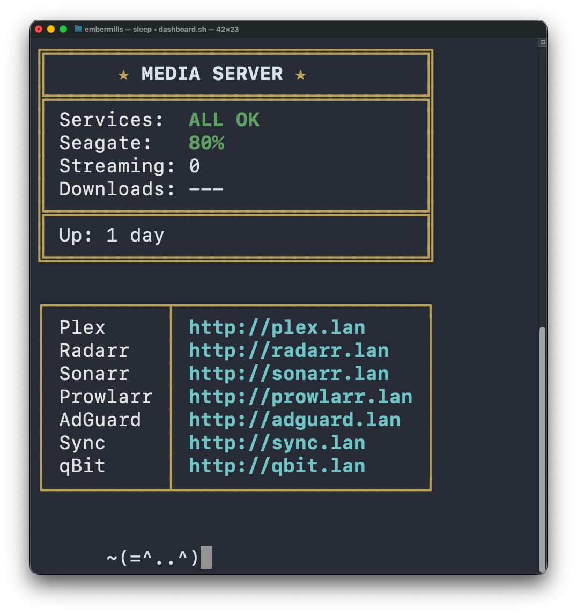

# terminal-dashboard

A minimal, self-contained bash dashboard for monitoring a home media server. Displays service health, disk usage, active Plex streams, download speed, uptime, and quick-access links — all in a single terminal window with an animated cat.



## Features

- Service monitoring (Plex, Sonarr, Radarr, Prowlarr, AdGuard, Syncthing)
- Seagate external drive usage
- Active Plex stream count
- qBittorrent download speed
- System uptime
- Web UI quick-links table
- Auto-refresh every 60 seconds
- Animated cat patrols the bottom of the terminal

## Requirements

- macOS (uses `defaults read`, `pgrep`, `tput`)
- `curl`, `python3`
- Plex Media Server running locally
- qBittorrent Web UI reachable on the network

## Configuration

All settings are at the top of `dashboard.sh`:

| Variable | Default | Description |
|---|---|---|
| `PLEX_TOKEN` | Read from macOS defaults | Plex authentication token |
| `QBIT_URL` | `http://192.168.1.133:8080` | qBittorrent Web UI address |
| `QBIT_USER` | `admin` | qBittorrent username |
| `QBIT_PASS` | *(empty)* | qBittorrent password |
| `REFRESH_INTERVAL` | `60` | Seconds between data refreshes |

Set credentials via environment variables:

```bash
export QBIT_PASS="yourpassword"
./dashboard.sh
```

## Usage

```bash
chmod +x dashboard.sh
./dashboard.sh
```

Press `Ctrl+C` to exit. The terminal is automatically reset on exit.

## License

MIT
